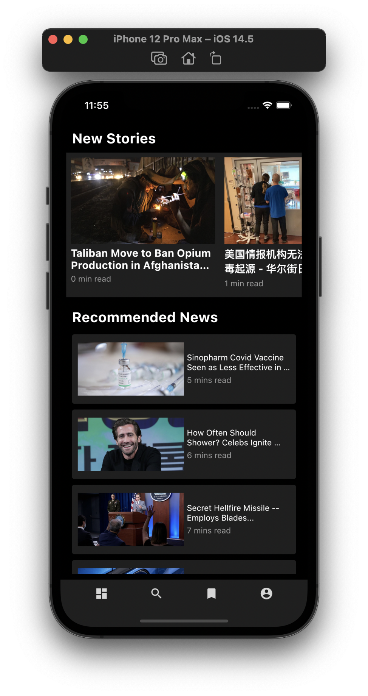
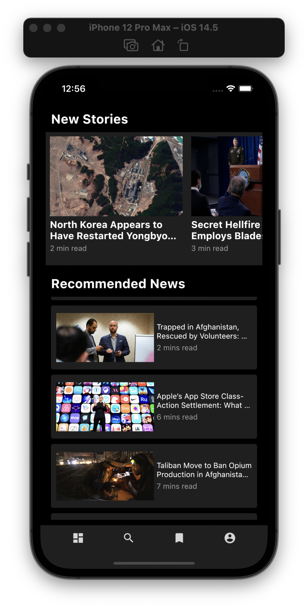
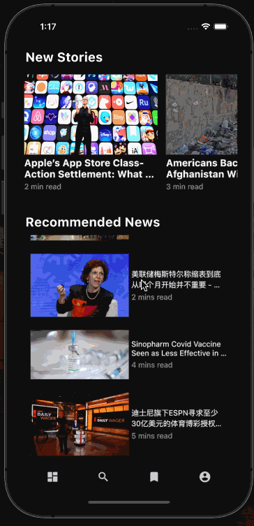
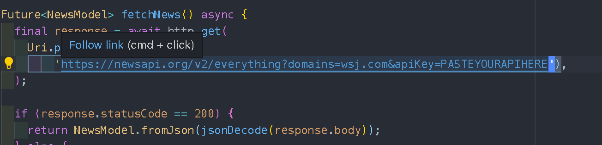

#Flutter apps with newsapi

##Screenshot

##How to re run this apps locally

1. Clone this repo `git clone 'link to this page'`
2. Create news api account [here](https://newsapi.org/) for using your own api key
3. Copy and paste your own api key to api.dart that can be found in this project `lib/controller/api.dart`
   
4. Open your emulator (mobile)
5. Run flutter project `flutter run`

##Future plan

1. Add click function to read the news
2. Fix readme.md
3. PageView

##Foot note
_Not yet_

**_Disclaimer_**: Original design can be found [here](https://dribbble.com/shots/13230921-News-Mobile-App/attachments/4833476?mode=media)
