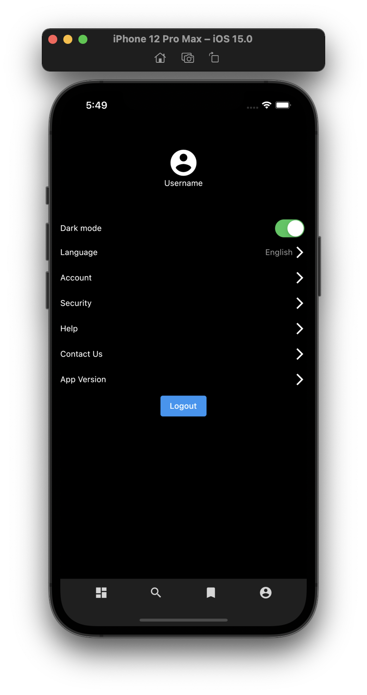

# Flutter apps with newsapi

---

As a business person, I want my news is already selected that only the most interesting that I will read, that I am a busy person.

As an ordinary person, I want my news is cluttered and also I want to read any interesting that went viral, You know Im the person that have fear of missing out!.

As a person, I only want to read my news, I dont want to setting anything, install and I already can read my news, fast.

> NewsPortal, We only display what you want, simply, really.

## Screenshot

---

## How to re run this apps locally

---

1. Clone this repo `git clone 'link to this page'`
2. Create news api account [here](https://newsapi.org/) for using your own api key
3. Copy and paste your own api key to api.dart that can be found in this project `lib/controller/api.dart`
   
4. Open your emulator (mobile)
5. Run flutter project `flutter run`

## Future plan

---

_Currently I have nothing in mind_

## Foot note

---

_Not yet_

**_Disclaimer_**: Original design can be found [here](https://dribbble.com/shots/13230921-News-Mobile-App/attachments/4833476?mode=media)
